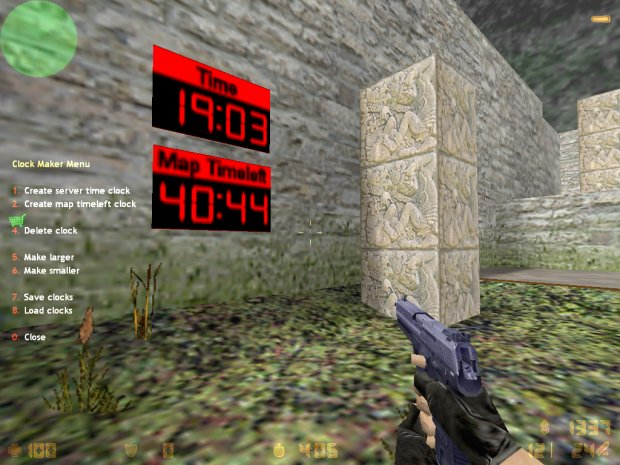

# Clockmaker
In-game clocks plugin for Counter-Strike 1.6. Built for [AMX Mod X](https://www.amxmodx.org) using the Pawn programming language. Released in August 2007 on [AlliedModders](https://forums.alliedmods.net/showthread.php?t=59069).

Allows you to create various clocks on the map that you can save and will load again on map load.

Say "/cm" to bring up the main menu.

## Clock Types
- Server time (Displays the servers time +/- the time offset CVAR value)
- Map timeleft (Displays the amount of time remaining on the map)

See extended [readme](cstrike/addons/amxmodx/clockmaker_v1.1_readme.txt) for more information.
